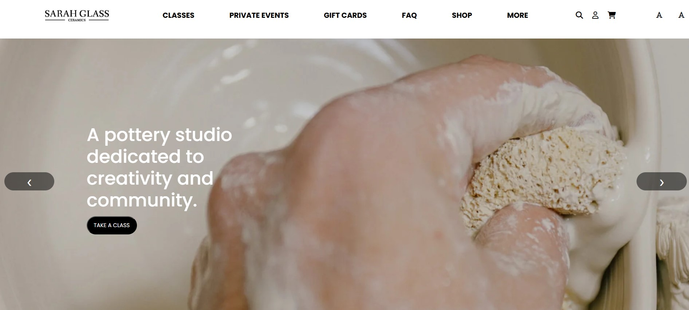
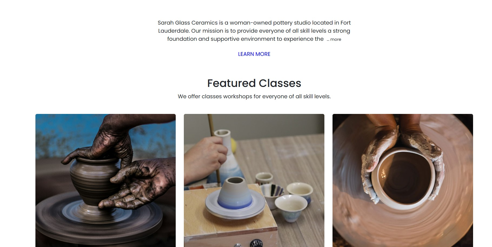

# Proyecto de Interactividad en el DOM 🎉

Este proyecto forma parte de mi aprendizaje (hasta el momento) en el Curso de Programador Web Inicial Front End Developer dictado por la Universidad Tecnológica Nacional (**UTN**) con la profesora Cecilia Prado. El objetivo principal es agregar interactividad a la página web **"Sarah Glass"**, utilizando JavaScript para manipular el DOM y mejorar la experiencia del usuario.

El sitio web está desarrollado en HTML y CSS, y para este proyecto he implementado entre 2 y 3 funcionalidades interactivas con JavaScript, logrando así una página más dinámica e interactiva.

## 📸 Screenshots

## 🚀 Features de JS en el DOM

- **Carrousel de Imágenes** 🎠 permite navegar entre varias imágenes de manera interactiva. Utiliza botones **Siguiente** y **Anterior** para desplazarse entre las imágenes de forma fluida. Al hacer clic en estos botones, el carrusel se mueve horizontalmente mostrando la siguiente o la anterior imagen.
- **Leer Más/Leer Menos** 📖 Esta funcionalidad permite expandir o contraer un bloque de texto. Cuando el usuario hace clic en el enlace **... más**, el contenido adicional se revela. El enlace cambia dinámicamente entre **...más** y **menos**, según el estado del contenido.
- **Aumento y Disminución de Tamaño de Fuente** 🔠 Los usuarios pueden aumentar o disminuir el tamaño de la fuente en el sitio web utilizando los botones correspondientes. Esto mejora la **accesibilidad** y permite personalizar la experiencia de lectura, ajustando el texto al gusto del usuario.

## 🛠 Tech Stack

**Frontend:** HTML, CSS, Javascript

## ⚙️ IMPORTANTE 
🛠️ ¿Necesitas instalar algo?
**NO, No Depende de Paquetes Externos**🚫📦
Este proyecto fue desarrollado sin dependencias externas. Toda la funcionalidad de JavaScript y la interactividad se implementó utilizando solo las capacidades nativas del lenguaje, sin necesidad de bibliotecas o frameworks adicionales.

